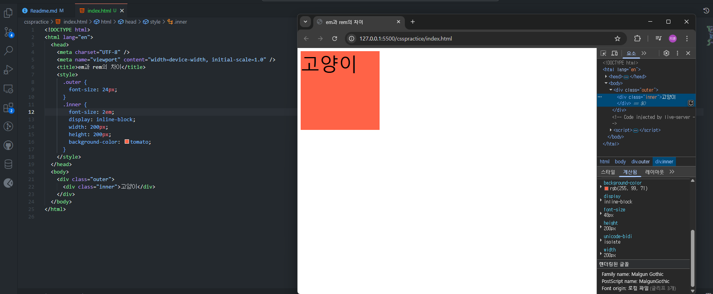
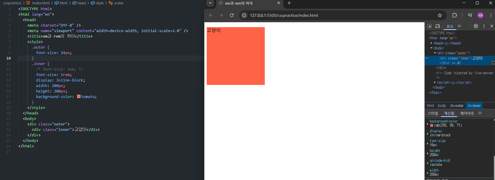

2025-03-13

반응형 웹과 부족한 퍼블리싱 실력, css에 대한 이해도를 높이고자 만든 연습 프로젝트입니다.

1em 이란 부모 font-size의 값이다. 기본적으로 16px이며, 부모 font-size가 24px 일 경우 1em은 24px, 2em은 48px이 된다.

1rem 이란 html의 font-size의 값이다. 기본적으로 16px이며, html태그 내에 font-size를 따로 지정할 경우 해당 size를 상속받는다.
16px일 때(default)를 기준으로 2rem은 32px가 되는 구조이다.

