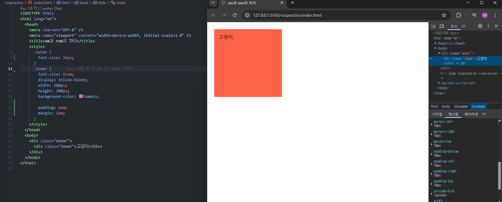
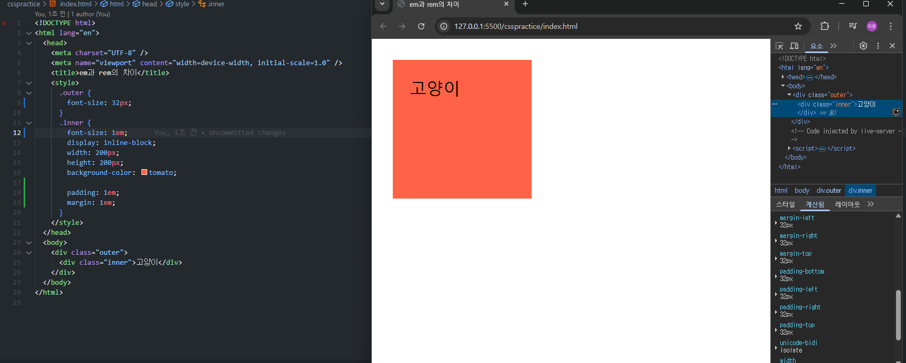

# 2025-03-13

### 반응형 웹과 부족한 퍼블리싱 실력, css에 대한 이해도를 높이고자 만든 연습 프로젝트입니다.

## 1em 이란 부모 font-size의 값이다. 기본적으로 16px이며, 부모 font-size가 24px 일 경우 1em은 24px, 2em은 48px이 된다.

## 1rem 이란 html의 font-size의 값이다. 기본적으로 16px이며, html태그 내에 font-size를 따로 지정할 경우 해당 size를 상속받는다.

16px일 때(default)를 기준으로 2rem은 32px가 되는 구조이다.

## 새롭게 알게 된 사실

padding은 요소 내의 내부 여백을, margin을 요소와 요소 외부와의 여백(간격)을 의미한다. 여기까지는 원래 알고 있던 사실이다.
하지만 padding과 margin에서의 em은 부모요소의 font-size를 상속받는것이 아닌, 자기 자신의 font-size를 따라간다는 점을 새롭게 알게됐다.

가령,

위와 같은 코드에서 inner의 font-size는 1rem이다. 즉 루트요소의 font-size를 따로 지정하지 않았기에 16px이 되고, padding과 margin 또한 16px이 된다.

하지만 아래의 경우

inner의 font-size는 1em으로 부모의 font-size: 32px을 상속받는다. 이로 인해 inner의 font-size이 32px가 되고, padding과 margin 또한 32px이 된다.
