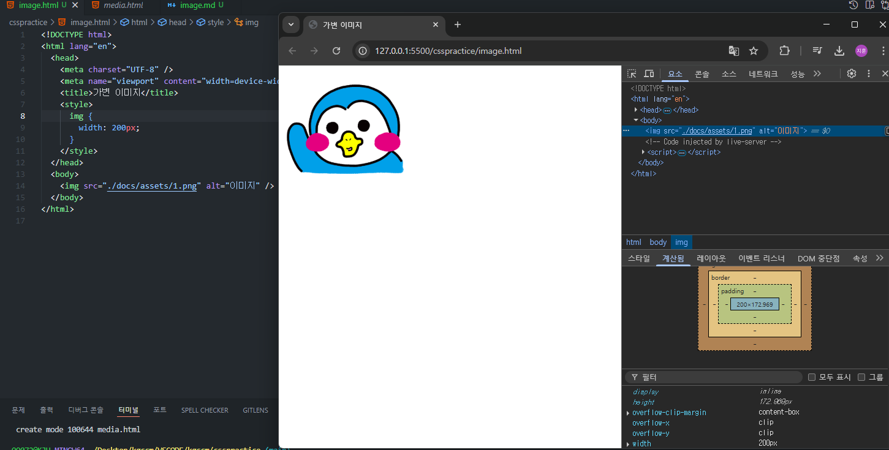
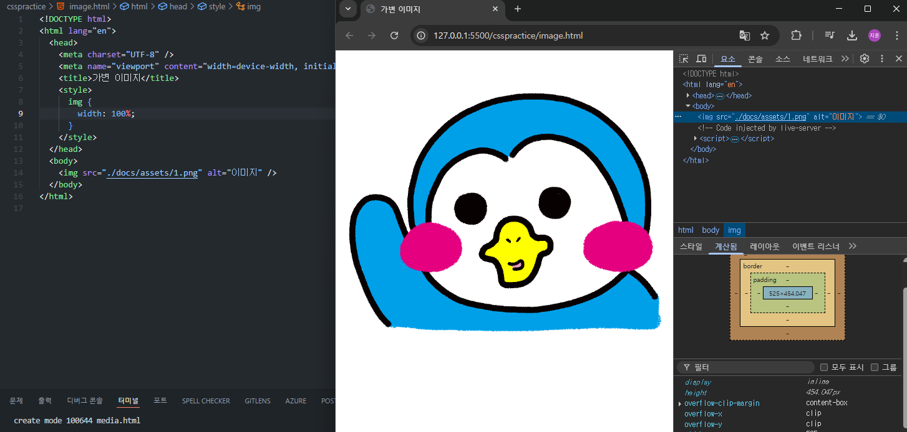
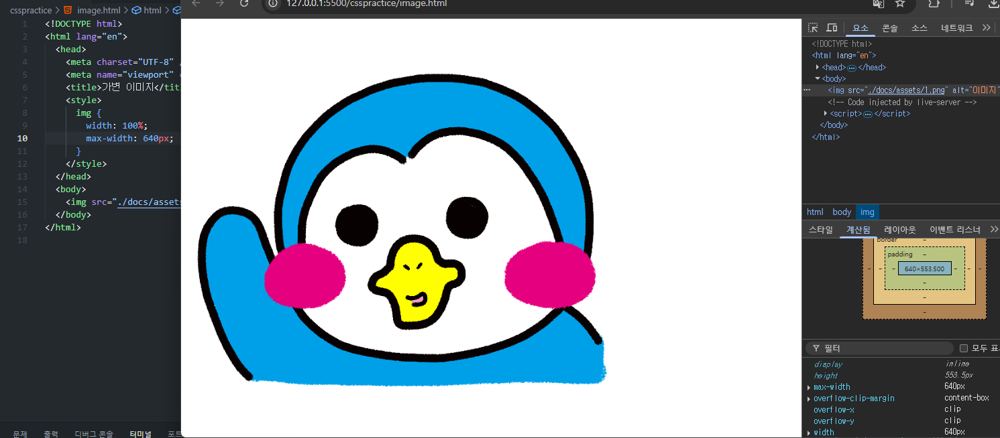

## 기본 개념을 처음부터 다시 정리하는 공간. 조급해하지말고 기초부터 탄탄히

## 이미지의 크기를 가변적으로 사용하기기

## 기본적으로 적용되어있는 width : 200px 로 인해 브라우저의 넓이와 관계없이 고정된 이미지 크기를 가진다.

## 이미지 width를 100%를 주었을 경우, 브라우저 사이즈의 100% 크기만큼 이미지의 width가 늘어나고, 이에 따라 height 또한 자동으로

## 늘어나 이미지의 픽셀이나 해상도가 깨지고, 떨어지게 된다.

## 이를 방지하기 위해 max-width를 사용한다.

## 이미지의 크기는 브라우저의 100%를 차지하지만, 최대 640px를 추가로 지정하여 최대값을 지정해주었다.

## 브라우저의 크기가 최대여도 이미지는 최대 640px의 값을 고정으로 가져가며 가변적인 이미지 비율을 상황에 따라 알맞게 지정할 수 있다.
