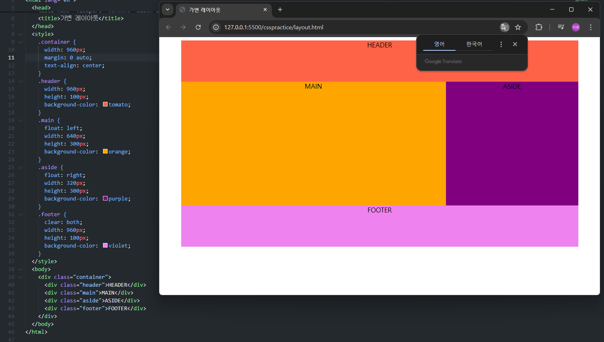
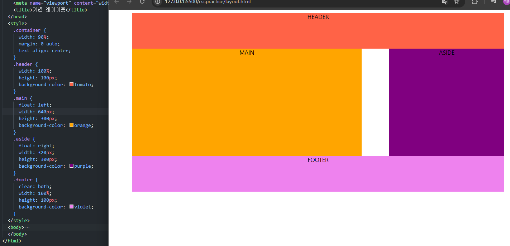
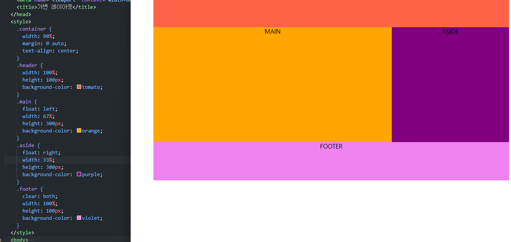
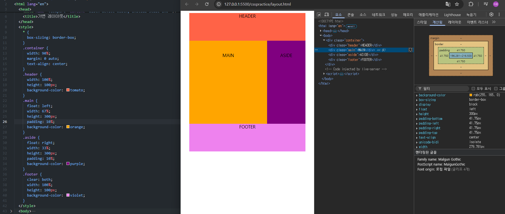
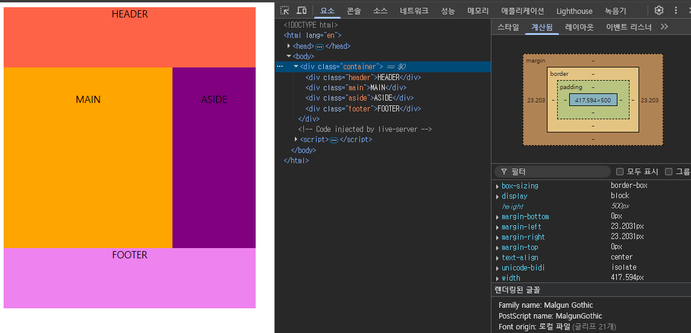

## 가변 레이아웃

# 기본 배치

기본적인 배치를 해주었다. main은 좌측, aside는 우측에 붙어야 하기 때문에 float 속성을 이용해주었다.
footer는 main과 aside의 float 속성으로 인해 내부 contents의 레이아웃이 변경되는것을 방지하기 위해 clear:both처리를 했다.

# 가변 레이아웃(%)

container의 넓이를 90%로 바꾸고, Header와 Footer의 넓이를 100%로 변경했다.
% 단위는 부모 요소의 크기를 상속받기 때문에 Header와 Footer는 container의 width와 동일하며 화면이 줄어들어도 줄어든 화면의 90%를 차지한다.
이때 main과 aside를 따로 지정하지 않아 레이아웃이 깨지게 되는데 이를 알맞게 수정해야한다.

960px의 640px는 약 67%이다. 그렇다면 main은 67%, aside는 33%가 된다. 그렇게 바꿔주니 화면을 늘리거나 줄여도 알맞게 배치된 모습이다.

## 새롭게 알게 된 사실

# margin과 padding

padding과 margin은 부모의 여백이 기준이 아닌, 부모의 넓이를 기준으로 삼는다

padding을 10%로 설정해보았다. 이 padding은 부모, 즉 container의 넓이인 90%의 10%를 의미하는데 41.75px이 나왔다.
개발자 도구로 container의 넓이를 확인해보니

container의 width 가 417.594px이 계산된다. 즉 container의 넓이의 10%가 padding인 셈이다. 항상 padding과 margin을 px단위로 해왔는데 새로운 사실을 알게돼었다.
