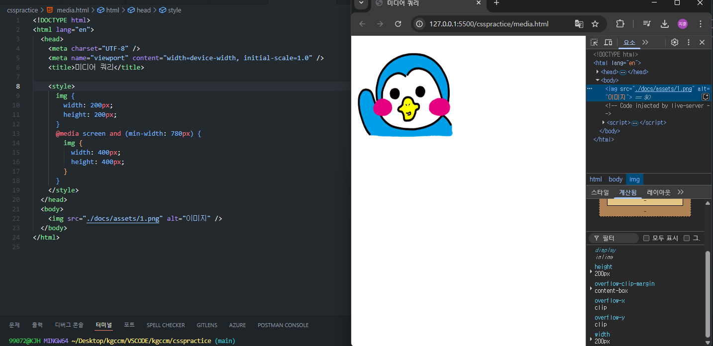
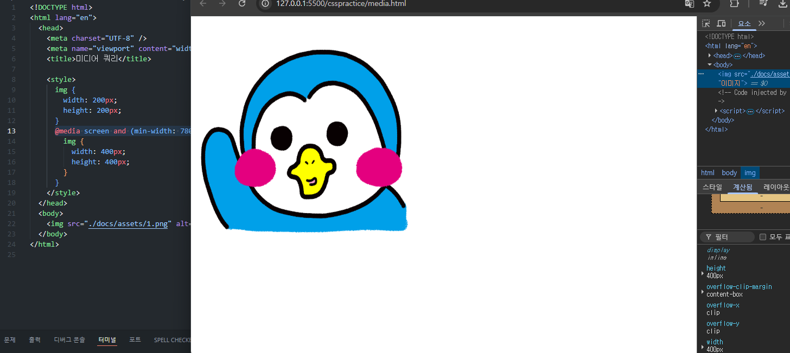

## 기본 개념을 처음부터 다시 정리하는 공간. 조급해하지말고 기초부터 탄탄히

## media query란 화면의 넓이에 따라 동적으로 변화하는 반응형 레이아웃을 스타일링 할 떄 사용한다.

## 기본적으로 적용되어있는 스타일은 200 x 200 사이즈다. 하지만 여기서 화면의 넓이가 증가한다면

## 이미지의 사이즈가 변화하는 것을 알 수있다. 이를 활용해 반응형 웹 레이아웃을 스타일링 할 수 있다.
