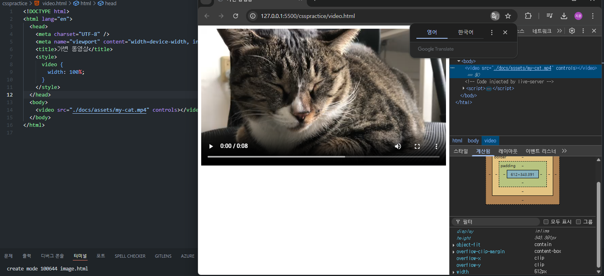
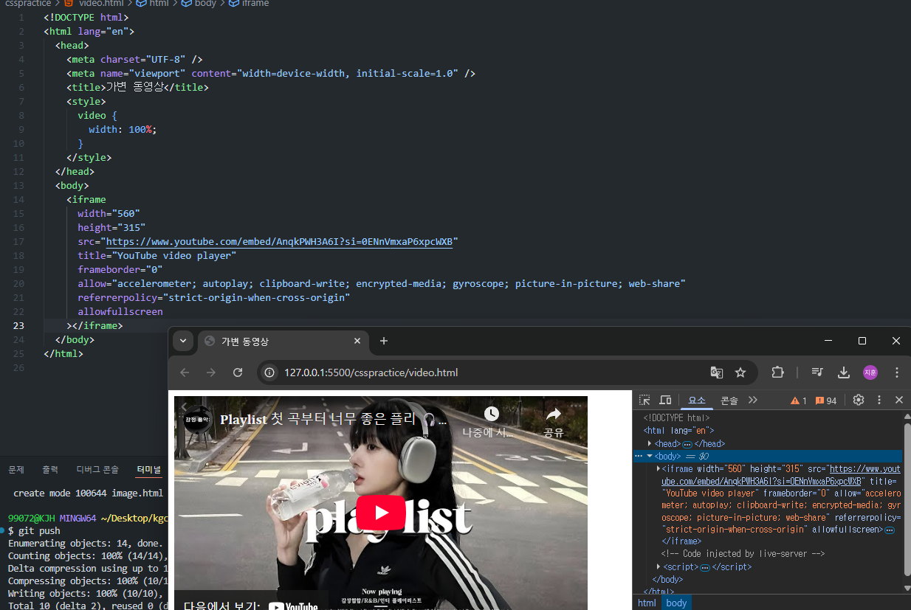
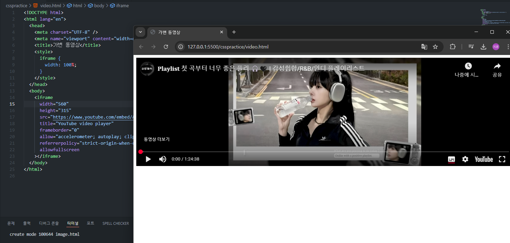
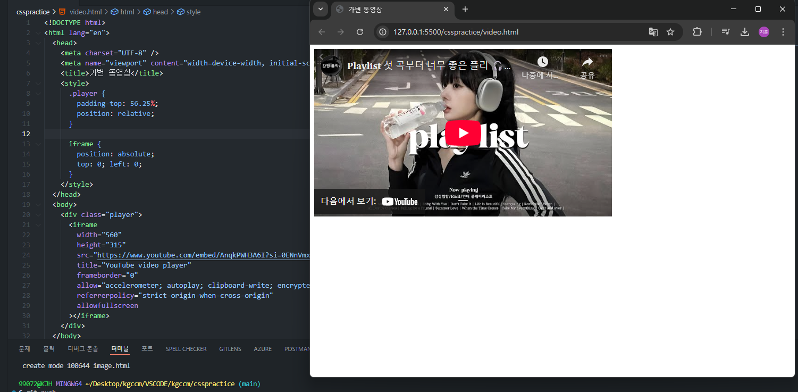
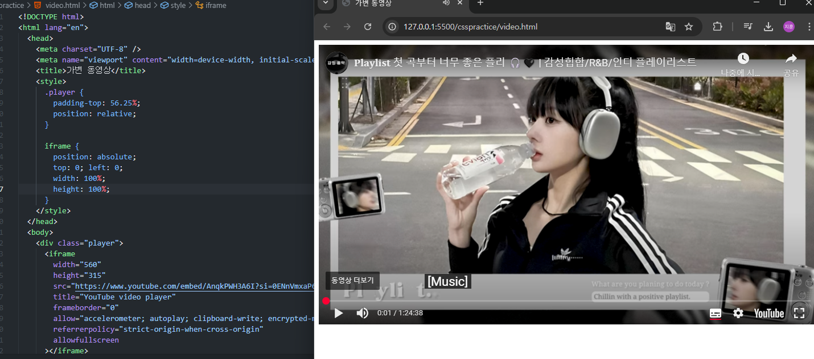

## 기본 개념을 처음부터 다시 정리하는 공간. 조급해하지말고 기초부터 탄탄히

## HTML에 동영상을 첨부하고 싶을 땐 video 속성을 이용한다.

## controls 속성을 추가하여 재생,음량 등을 컨트롤하는 패널을 추가 할 수 있고, 여기서 기본적으로 100%를 지정하여 브라우저 전체크기로 지정할 수 있다.

## 그렇다면 다른 속성을 알기 위해 유튜브 동영상을 퍼오는 태그를 사용해보자

유튜브에서 퍼가기를 클릭하면 다음과 같이 iframe ~~ 하는 속성 태그값들이 나오고, 이를 복사하여 내 프로젝트에 넣게되면

위와 같이 영상의 비율이 똑같이 나오게 된다.

## iframe 속성은 웹 요소를 다른 웹에 보여줄 수 있게 한다.

### 그렇다면 이런 경우도 있을 것이다. 다른 영상을 내 프로젝트에 임베드해와서, 해당 영상 컨텐츠의 위치나 사이즈를 지정하고싶다.

해당 작업을 하기 위해 iframe의 width 속성을 100%로 늘려보았다. 결과는?

영상 컨테이너의 width만 100% 가 됐고, 실질적인 영상 컨텐츠의 width는 그대로였다.

내가 원하는 것은 영상 컨텐츠의 크기를 조절함과 동시에 나의 다른 컨텐츠에 영향을 받지 않도록 영상의 위치를 좌측 상단에 붙이는 것이다.

그러기 위해 iframe을 div 컨테이너로 한번 묶어주었다. 그 후 div에 동영상의 종횡비인 56.25%를 padding-top에 주어 여백을 부여하고,
position 을 relative로 주어 div를 기준으로 iframe의 위치를 지정한다.
iframe의 position을 absolute로 지정하여 div를 기준으로 좌측 상단에(절대값) 위치하게끔 하면 위와 같은 결과가 나온다.
영상의 하단은 빈 공간이기 때문에 다른 요소나 컨텐츠가 위치 할 수 있고, 레이아웃 또한 깨지지 않는다.

그리고 마지막으로 iframe의 width와 height를 100%로 지정하면?

영상 컨텐츠의 크기가 바뀌었다!

### 새롭게 알게 된 점

iframe의 width와 height의 비율을 계산하면 종횡비가 나오고, 이 종횡비를 이용해 정확한 컨테이너의 여백을 지정할 수 있다.
이 여백의 좌상단 끝에 영상을 절대값으로 위치시키면 div컨테이너의 종횡비는 브라우저 크기의 변화에 따라 계속 일정 종횡비를 유지하고
그 여백 안에 영상에 위치하여 영상의 크기는 변화가 없다. 여기서 직접 속성을 지정하여 영상의 크기를 조절할 수도 있다.
이러한 방법을 사용하면 브라우저의 크기나 컨텐츠들에 영향을 받지 않으며 정확한 비율 내에서 동영상을 보여줄 수 있다.
